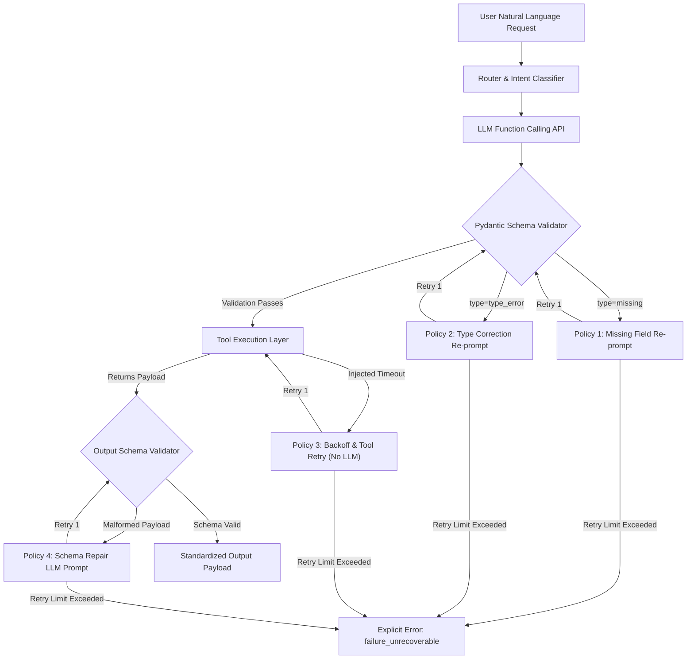

# AI Function-Calling Router with Pydantic & Targeted Recovery

A resilient LLM function-calling orchestration layer that replaces blind retry loops with **four targeted recovery policies**, strict Pydantic validation boundaries, deterministic fault injection, and bounded failure guarantees.

---

## Architecture Overview

Production tool-calling agents fail in predictable ways: missing arguments, invalid formats, upstream timeouts, and unexpected schema changes. Instead of sending raw Python stack traces back into the LLM context, this router classifies each failure at the schema boundary and applies a bounded, category-specific recovery strategy.



---

## Targeted Recovery Policies

| Failure Class | Trigger | Recovery Mechanism | Token Overhead |
| :--- | :--- | :--- | :--- |
| **Missing Fields** | `ValidationError` (`type=missing`) | Narrow targeted prompt extracting only the missing field name from context. | Minimal |
| **Type Errors** | `ValidationError` (`type=type_error` / format) | Format-specific casting prompt (e.g. converting `"tomorrow"` to `YYYY-MM-DD`). | Minimal |
| **Upstream Timeouts** | `TimeoutError` (HTTP 504 / 503) | System-level backoff delay (0.1s) and direct Python tool retry. | **0 tokens** (No LLM call) |
| **Malformed Output** | Tool output schema validation failure | Schema repair prompt providing the corrupted payload and expected JSON schema. | Bounded |

> **Hard Bound Guarantee**: Every recovery strategy is strictly limited to **1 retry**. If the second attempt fails, the router returns an explicit structured failure:
> ```json
> {"status": "error", "reason": "<failure_class>_unrecoverable"}
> ```

---

## Tools Implemented

1. **FlightSearch**:
   - *Inputs*: `origin` (str), `destination` (str), `date` (ISO-8601 `YYYY-MM-DD`).
   - *Output*: `FlightSearchOutput` (`status`, `flight_number`, `origin`, `destination`, `date`, `price`).
2. **CalendarBooking**:
   - *Inputs*: `event_title` (str), `start_time` (datetime ISO), `duration_minutes` (positive int).
   - *Output*: `CalendarBookingOutput` (`status`, `booking_id`, `event_title`, `start_time`, `duration_minutes`).
3. **WeatherLookup**:
   - *Inputs*: `location` (str), `unit` (Enum: `C` or `F`).
   - *Output*: `WeatherLookupOutput` (`status`, `location`, `temperature`, `unit`, `condition`).
4. **UnitConversion**:
   - *Inputs*: `value` (float), `from_unit` (str), `to_unit` (str).
   - *Output*: `UnitConversionOutput` (`status`, `original_value`, `converted_value`, `from_unit`, `to_unit`).

---

## Benchmark Results

Evaluation results generated across 60 test cases (`data/eval.jsonl`) with ~40% injected fault mix:

```
============================================================
                 BENCHMARK SUMMARY RESULTS
============================================================
Metric                    | Baseline     | Recovery Active
------------------------------------------------------------
Completion Rate           | 46.67%       | 96.67%         
Silent Wrong Rate         | 0.00%        | 0.00%          
Mean Recovery Attempts    | 0.00         | 0.53           
============================================================
```

- **Completion Rate Jump**: From 46.67% to 96.67% (+50 percentage points).
- **Silent Wrong Rate**: Maintained at 0.00% because unrecoverable failures give up explicitly rather than hallucinating success.

---

## Quickstart & Reproducibility

### 1. Local Python Setup

```bash
# Clone and create virtual environment
python -m venv .venv
source .venv/bin/activate   # On Windows: .venv\Scripts\activate

# Install dependencies
pip install -r requirements.txt

# Run unit tests
pytest -v

# Run the evaluation harness
python evaluate_router.py
```

### 2. Running with Docker Compose

```bash
# Run the evaluation harness inside Docker container
docker compose up --build
```

The evaluation results will be written directly to `output/metrics.json`.

---

## Repository Structure

```
├── .env.example              # Documented configuration variables
├── Dockerfile                # Evaluation container definition
├── docker-compose.yml        # Compose configuration mounting ./output
├── evaluate_router.py        # Comparative batch evaluation harness
├── requirements.txt          # Pinned Python dependencies
├── data/
│   └── eval.jsonl            # 60 evaluation test cases
├── output/
│   └── metrics.json          # Benchmark metrics output
├── src/
│   ├── __init__.py
│   ├── fault_injector.py     # Fault injection middleware and context
│   ├── llm_client.py         # OpenAI client + deterministic offline engine
│   ├── router.py             # Router with 4 targeted recovery policies
│   ├── schemas.py            # Pydantic input & output models
│   └── tools.py              # Mock tool implementations
└── tests/
    ├── test_router_recovery.py
    └── test_schemas_and_faults.py
```
